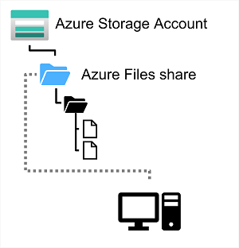

# Azure Files

### An overview of file shares locally
Many on-premises systems, comprising a network of in-house computers, make use of file shares.

A file share enables you to store a file on one computer and grant access to that file to users and applications running on other computers. 

This can work well for computers in the same local area network, but doesn't scale well as the number of users increases, or if users are located at different sites

### Where Azure Files comes in
* A way to create cloud-based network shares, such as you typically find in on-premises organisations

* Hosting file shares in Azure can eliminate hardware costs and maintenance overheads

* High availability and scalable cloud storage for files

### Azure Files in detail
* You create Azure File storage in a storage account
* Enables you to share up to 100 TB of data in a single storage account
* Maximum size of a single file is 1 TB
* You can set quotas to limit the size of each share below 1 TB
* Supports up to 2000 concurrent connections per shared file
* After creating a storage account, you can upload files to Azure File Storage using the Azure portal
* Can also use tools such as _AzCopy_ utility
* Can also use the _Azure File Sync_ service to synchronise locally cached copies of shared files with the data in Azure File Storage
* Azure Files supports 2 common network file sharing protocols:
    * **_Server Message Block_** (SMB) file sharing is commonly used across multiple OS's (Windows, Linux, macOS)
    * **_Network File System_** (NFS) shares are used by some Linux and macOS versions. You must use a premium tier storage account to create an NFS share and create and configure a virtual network through which access to the share can be controlled

### Performance Tiers

**Standard Tier**:
Uses hard disk-based hardware in a datacenter

**Premium Tier**:
Uses solid-state disks. Offers greater throughput, but is charges at a higher rate

