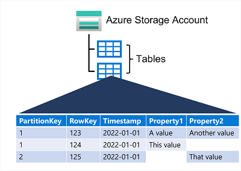

# Azure Tables
Azure Table Storage is a NoSQL storage solution that makes use of tables containing _key/value_ data items

Each item is represented by a row that contains columns for the data fields that need to be stored

* Azure Tables are **not** like a table in a relational DB as it allows you to store semi-structured data
* All rows in a table must have a unique key (composed of a partition key and a row key)
* When you modify data a _timestamp_ column records the date and time the modification was made; but other than this, the columns in each row can vary
* Azure Table Storage tables have **no** concept of:
    * Foreign keys
    * Relationships
    * Stored procedures
    * Views
    * Other objects you may find in an RDB
* Data is usually de-normalised with each row holding the entire data for a logical entity
* Number of fields in each row can be different

### Partitioning in Azure Tables
A table is split into partitions to ensure fast access

Partitioning is a mechanism for grouping related rows based on a common property or partition key

Rows that share the same partition key are stored together

Partitioning helps organise data as well as improving scalability and performance in the following ways:
* Partitions are **independent** from each other, they can grow or shrink as rows are added to, or removed from, a partition. A table can contain any number of partitions
* You can include the partition key in  search criteria. This helps to narrow down the volume of data to be examined therefore improving performance by reducing amount of I/O ops (or read & writes) to locate data

The key in an Azure Table Storage table comprises two elements:
* the partition key that identifies the partition containing the row
* a row key that is unique to each row in the same partition

Items in the same partition are stored in row key order. If an application adds a new row to a table, Azure ensures that the row is placed in the correct position in the table

This scheme enables an app to quickly perform point queries that identify a single row, and range queries that fetch a contiguous block of rows in a partition